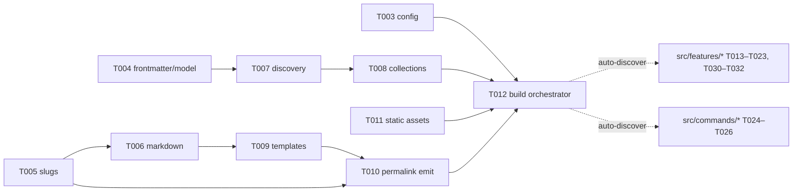

# Kiln — Execution Plan & Ticket Index

37 tickets, 5 waves. Waves run strictly in order; tickets **inside** a batch run
in parallel. Every ticket has exclusive file ownership — no two tickets in the
same batch may edit the same file.

## Concurrency rules (the orchestration contract)

1. **Wave gating**: wave _N+1_ starts only after wave _N_ is fully verified
   (`npm run typecheck && npm test` green). Intra-wave deps are listed per batch.
2. **Exclusive ownership**: each ticket lists the files it creates/edits. A
   ticket may never edit a file owned by another ticket. Cross-cutting needs go
   through the extension seams below.
3. **No shared registration files.** Two seams, both defined once in T002/T012
   and never edited again:
   - `src/commands/*.ts` — auto-discovered; each command module exports
     `{ name, run }`. Adding a command = one new file.
   - `src/features/*.ts` — auto-discovered; each exports a `Feature` with hooks.
     Adding a feature = one new file + one optional partial in
     `templates/partials/` (new file).
4. **Config stays open**: `kiln.config.ts` exposes `features?: Record<string,
   unknown>`; each feature validates its own options. T003 never gains
   feature-specific keys.
5. **Frontmatter stays open**: `Document.data` is `Record<string, unknown>`;
   features read their own fields.
6. **Markdown seam**: features register markdown-it plugins via
   `Feature.extendMarkdown(md)` (defined in T006/T012); core renderer never
   imports a feature.
7. **Parallel limits**: batches are ≤ 11 tickets; fan out with `workpool` /
   `tasks[]` accordingly.

## Pipeline architecture



## Ticket index

Format: `ID — Title · batch · deps · owns (abbrev) · goal`

### Wave 0 — Foundation (serial → fan-out)

| ID | Title | Batch | Deps | Owns | Goal |
|----|-------|-------|------|------|------|
| T001 | Repo scaffold | W0·B1 | — | `package.json`, `tsconfig.json`, `.gitignore` | npm pkg, strict tsconfig, `typecheck`/`test` scripts, git init |
| T002 | CLI skeleton & command discovery | W0·B2 | T001 | `src/cli.ts`, `src/commands/{help,version}.ts` | arg dispatch, help/version, auto-discovery of command modules, exit codes |
| T003 | Config loader | W0·B2 | T001 | `src/config.ts` | import local `kiln.config.ts`, defaults, validation, open `features` map |

### Wave 1 — Content model

| ID | Title | Batch | Deps | Owns | Goal |
|----|-------|-------|------|------|------|
| T004 | Frontmatter & Document model | W1·B1 | T003 | `src/content/document.ts` | gray-matter parsing, typed `Document`/`Page`/`Site` with open `data`, date handling, precise errors |
| T005 | Slugs & URL helpers | W1·B1 | T003 | `src/content/slug.ts` | unicode-safe slugs, permalink templates, path→URL mapping |
| T006 | Markdown renderer | W1·B2 | T004, T005 | `src/content/markdown.ts` | markdown-it GFM render + `extendMarkdown` seam for features |

### Wave 2 — Build pipeline

| ID | Title | Batch | Deps | Owns | Goal |
|----|-------|-------|------|------|------|
| T007 | Content discovery | W2·B1 | T004, T005 | `src/content/discover.ts` | recursive glob of `content/`, exclusion rules, → `Site` |
| T009 | Template engine & base layouts | W2·B1 | T006 | `src/render/templates.ts`, `templates/*.html` | nunjucks env, layout inheritance, partial auto-load, default base/post/index layouts |
| T011 | Static asset passthrough | W2·B1 | T003 | `src/render/assets.ts` | copy `public/` → `dist/`, hash-bust option |
| T008 | Collections & queries | W2·B2 | T007 | `src/content/collections.ts` | posts/pages collections, sort by date, filters (tags, draft flag) |
| T010 | Permalink emission | W2·B2 | T005, T009 | `src/render/emit.ts` | render page → pretty-path `.html`, write to `dist/` |
| T012 | Build orchestrator, feature contract & report | W2·B3 | T007–T011 | `src/pipeline/{build,features,report}.ts`, `src/commands/build.ts`, `src/feature.ts` | wire stages, define `Feature` hooks + auto-discovery, build report, `kiln build` |

### Wave 3 — Features (all dep T012; parallel except T015)

| ID | Title | Batch | Deps | Owns | Goal |
|----|-------|-------|------|------|------|
| T013 | Drafts & scheduled publishing | W3·B1 | T012 | `src/features/publish.ts` | hide drafts/future posts unless `--drafts`/`--future` |
| T014 | Tags & category archives | W3·B1 | T012 | `src/features/taxonomy.ts` | generate tag/category index + archive pages |
| T016 | Syntax highlighting | W3·B1 | T012 | `src/features/highlight.ts` | highlight.js via `extendMarkdown`, lang labels |
| T017 | Heading anchors & TOC | W3·B1 | T012 | `src/features/toc.ts` | slugified heading IDs, TOC data + partial |
| T018 | RSS/Atom feed | W3·B1 | T012 | `src/features/feed.ts` | valid Atom feed at `/feed.xml`, full content |
| T019 | Sitemap.xml | W3·B1 | T012 | `src/features/sitemap.ts` | sitemap from emitted URLs, lastmod |
| T020 | Excerpts | W3·B1 | T012 | `src/features/excerpt.ts` | frontmatter override or first-paragraph summary |
| T021 | Reading time & word count | W3·B1 | T012 | `src/features/readingTime.ts` | word count + conservative reading time on Document |
| T022 | Related posts | W3·B1 | T012 | `src/features/related.ts` | tag-overlap scoring, top-N per post |
| T023 | Client-side search | W3·B1 | T012 | `src/features/search.ts`, `templates/partials/search.html`, `assets/search.js` | build `search-index.json`, no-deps client matcher, search partial |
| T015 | Pagination | W3·B2 | T014 | `src/features/pagination.ts` | paginate home & archive lists, prev/next + page URLs |

### Wave 4 — Developer experience (B1 parallel; T028 after)

| ID | Title | Batch | Deps | Owns | Goal |
|----|-------|-------|------|------|------|
| T024 | `kiln new` | W4·B1 | T002, T003 | `src/commands/new.ts` | scaffold post with valid frontmatter, slug filename |
| T025 | `kiln clean` | W4·B1 | T002 | `src/commands/clean.ts` | remove `dist/`, safety check |
| T026 | Dev server | W4·B1 | T012 | `src/commands/serve.ts`, `src/server/*.ts` | static serve of `dist/`, correct MIME types |
| T027 | Watcher & incremental rebuild | W4·B1 | T012 | `src/watch.ts` | watch `content/ templates/ public/`, debounce, rebuild-on-change |
| T029 | Build cache | W4·B1 | T012 | `src/pipeline/cache.ts` | content-hash cache; skip unchanged pages; `--no-cache` |
| T028 | Live reload (SSE) | W4·B2 | T026, T027 | `src/server/reload.ts`, `templates/partials/live-reload.html` | SSE endpoint, inject client, rebuild→reload |

### Wave 5 — Quality & release

| ID | Title | Batch | Deps | Owns | Goal |
|----|-------|-------|------|------|------|
| T030 | HTML minification | W5·B1 | T012 | `src/features/minify.ts` | opt-in config, skip code/pre, tests on fixture HTML |
| T031 | Error reporting | W5·B1 | T012 | `src/errors.ts` + call sites in core files | file:line (frontmatter/template/markdown), aggregated, non-zero exit |
| T032 | Internal link checker | W5·B1 | T012 | `src/features/linkCheck.ts` | fail build on broken internal links/anchors, allowlist |
| T033 | Golden-site snapshot tests | W5·B1 | W3 all | `test/golden/**` | fixture site → snapshot `dist/`, regression suite |
| T034 | Example site | W5·B1 | W3 all | `site/**` | demo content exercising every feature, built in CI |
| T035 | Docs & README | W5·B1 | W3, W4 | `README.md`, `docs/**` | quickstart, config reference, feature & CLI docs |
| T036 | CI workflow | W5·B2 | T033 | `.github/workflows/ci.yml` | typecheck + test + build example site on push/PR |
| T037 | Release prep | W5·B3 | T035, T036 | `CHANGELOG.md`, version bump | semver, changelog, `npm pack` smoke test |

## Execution schedule

| When | What |
|------|------|
| Now | ✅ Plan + 37 tickets written (this repo). **No code yet — awaiting go.** |
| On your go | Wave 0 (3 tickets: 1 serial, then 2 parallel) |
| After W0 verified | W1 (2+1) → W2 (3+2+1) |
| After W2 verified | W3 fan-out: 10 parallel agents, then T015 |
| After W3 | W4 (5 parallel, then T028) → W5 (5 parallel, then docs/CI/release) |

Per-ticket verification is always `npm run typecheck && npm test` plus the
ticket's own observable acceptance check. Waves gate on green.

## Ticket template (all files under `tickets/`)

```markdown
# T0NN — Title

|             |                                        |
| ----------- | -------------------------------------- |
| Wave/batch  | Wn·Bm                                  |
| Depends on  | T0xx, T0yy                             |
| Blocks       | T0zz                                   |
| Owns        | `path/a.ts`, `path/b.test.ts`          |
| Size        | S / M / L                              |

## Goal
One paragraph: observable outcome.

## Requirements
- Bullet-level functional requirements (the "what", not implementation).

## Acceptance criteria
- [ ] Concrete, checkable items.

## Verification
- Exact commands + expected observable result.

## Non-goals
- What this ticket explicitly does NOT do.
```
