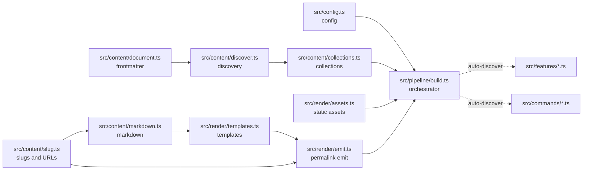

# Architecture

Kiln is a serial pipeline spine with two auto-discovery seams: commands
(`src/commands/*.ts`) and features (`src/features/*.ts`). Nothing in core
code imports a feature; everything optional plugs in through the hooks
below. This page is the map of how those pieces fit together.

## Pipeline overview

One `build()` call in `src/pipeline/build.ts` runs every stage:



The stage order inside one build:

```text
config → discover → seed site.data → feature discovery → onDocument
  → onSite → computeCollections → emitPages → copyAssets → cache.record
  → onBuildEnd → report
```

Failure split: non-feature failures (config, discovery, template, emit,
asset) throw, so the CLI prints `kiln: <message>` and exits 1 with no
report; feature failures — any hook rejection, including `ctx.options()`
validation — are recorded instead: the build stops, the report still
prints with partial counts, and the process exits 1.

## Stage-to-file map

| Stage | File |
| --- | --- |
| Config load and validation | `src/config.ts` |
| Frontmatter parsing / `Document` model | `src/content/document.ts` |
| Content discovery | `src/content/discover.ts` |
| Slugs, permalinks, URL mapping | `src/content/slug.ts` |
| Markdown rendering (markdown-it) | `src/content/markdown.ts` |
| Collections and ordering | `src/content/collections.ts` |
| `Feature` hook contract | `src/feature.ts` |
| Feature auto-discovery | `src/pipeline/features.ts` |
| Orchestration and stage wiring | `src/pipeline/build.ts` |
| Build report rendering | `src/pipeline/report.ts` |
| Incremental build cache | `src/pipeline/cache.ts` |
| Template engine and layouts | `src/render/templates.ts` |
| Permalink emission | `src/render/emit.ts` |
| Static asset passthrough | `src/render/assets.ts` |
| CLI dispatch and exit codes | `src/cli.ts` |
| Commands (auto-discovered) | `src/commands/*.ts` |
| Dev server and middleware | `src/server/*.ts` |
| File watcher | `src/watch.ts` |

## Extension seams

These seams are frozen registration points: two tickets may extend the
system in parallel only by adding files, never by editing shared
registries — the concurrency rule is that no two tickets in a batch edit
the same file.

### Command auto-discovery

`src/cli.ts` globs `src/commands/*.ts` and imports each module; a command
is any module exporting `{ name, run, description? }` with a unique
`name`. Adding a command = one new file; `src/cli.ts` never names a
command file. Dispatch maps outcomes to the three exit codes: 0 success,
1 failure, 2 usage.

### Feature hooks

`src/feature.ts` defines the `Feature` contract every
`src/features/*.ts` module implements (all hooks optional, invoked in
sorted-filename order):

- `extendMarkdown(md, ctx)` — register markdown-it plugins; applied once
  per rendered page, before any markdown.
- `onDocument(doc, ctx)` — each discovered page in path order, before
  markdown/layout render; mutating `doc.data` is legal.
- `onSite(site, ctx)` — once after all pages; may remove or append
  `Page`-shaped entries.
- `onBuildEnd(result, ctx)` — once per build, after emit and asset copy;
  may write files into the output directory.

Each hook receives a per-feature `FeatureContext` whose `ctx.options()`
reads `config.features[name]` through a feature-owned validator and
re-throws failures prefixed `features.<name>: `, so config errors always
carry the full key path.

### Open features config map

`kiln.config.ts` exposes `features?: Record<string, unknown>`. The config
loader stores it verbatim and never gains feature-specific keys; each
feature validates only its own slice. See the
[configuration reference](../README.md#configuration-reference) for the
documented keys.

### Markdown seam

Features reach the renderer only through `Feature.extendMarkdown(md)` —
`src/content/markdown.ts` applies collected registrations and the core
renderer never imports or discovers a feature module itself.

### Open frontmatter

`Document.data` is `Record<string, unknown>`: frontmatter stays
unvalidated and each feature reads (and may write) its own fields. The
conventions for the shared fields are documented in
[content model](content.md).
